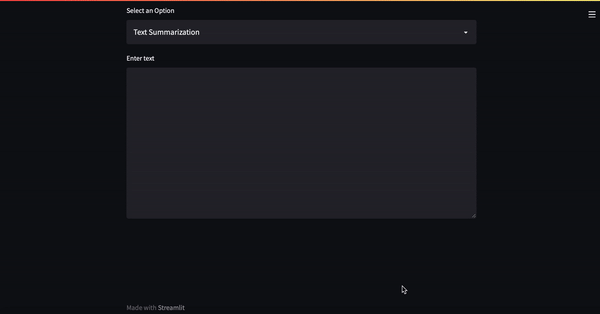

# Text Summarization using BART

**Group project for a Deep Learning course at HEC Paris with Xuwen Liu, Kanza Yous, Silvère Ngouela and Pierre Lavieille.**

**Chosen subject:** text summarization with Bidirectional Autoregressive Transformers.

This repo presents our results in a Streamlit app. We compare BART with a smaller version of BART trained on Xsum and fine-tuned without any freezed layer.

**Demo of the application:**

